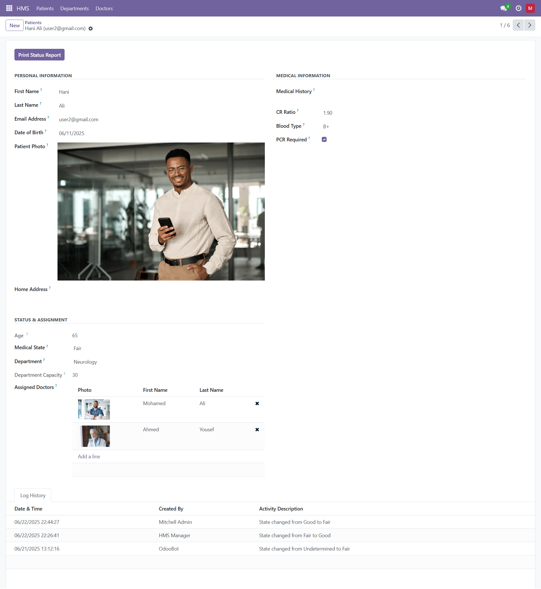

# Hospital Management System (HMS) – Odoo Module

## Overview

The **Hospital Management System (HMS)** module for Odoo offers a comprehensive solution for managing hospital operations. It enhances Odoo's core features with healthcare-specific workflows to streamline patient care, department coordination, doctor management, and activity logging.

---

## 🔑 Key Features

* **Patient Management**
  Manage personal and medical information including name, email, birth date, blood type, medical history, and CR ratio. Automatically computes age and enforces unique email constraints.

* **Department Management**
  Define departments with operational status and capacity. Prevents over-assignment by monitoring patient count.

* **Doctor Management**
  Store doctor profiles, specializations, and contact information. Assign patients and toggle active status. Email and phone formats are validated.

* **Activity Logging**
  Automatically logs all significant patient-related events (e.g., creation, state change) with details such as type, priority, and timestamps.

* **Customer Integration**
  Links patients to existing `res.partner` records, maintaining email consistency and preventing duplication.

* **Reporting**
  Generate detailed patient status reports, including medical state, department, assigned doctors, and activity logs.

* **Access Control**
  Uses Odoo’s security groups to restrict non-manager users to their own patient records only.

---

## 📁 Module Structure

### Models

* `hms_department.py`: Department model (capacity, status, patient linkage).
* `hms_doctors.py`: Doctor model (info, specialization, assignments).
* `hms_patient.py`: Patient model (medical data, CR ratio, history).
* `hms_patient_log.py`: Activity logs (state changes, metadata).
* `res_partner.py`: Enhances Odoo’s `res.partner` to support patient linkage.

### Views

* `hms_patient_view.xml`: UI for patients, doctors, departments, and logs.
* `res_partner_views.xml`: Extends partner views with patient linkage.

### Reports

* `hms_patient_report.xml`: Patient report configuration.
* `hms_patient_report_template.xml`: QWeb template for patient reports.

---

## ⚙️ Installation

1. Clone the repository into your Odoo `addons` directory:

   ```bash
   git clone https://github.com/ahmed-yousef-dev/odoo-hms-hospital-management.git
   ```

2. Restart your Odoo server.

3. Go to **Apps**, search for **"Hospital Management System"**, and install it.

4. Ensure dependencies like `base`, `mail`, etc., are available.

---

## 🔧 Configuration

### Security Groups

* `hms.group_hms_user`: Limited access to own records.
* `hms.group_hms_manager`: Full access to all HMS features.

Assign appropriate roles via **Settings > Users > Groups**.

---

## 🚀 Usage Guide

* **Create Departments**
  Navigate to **HMS > Departments** to define departments, capacity, and status.

* **Add Doctors**
  Go to **HMS > Doctors** to create and manage doctor profiles.

* **Manage Patients**
  Under **HMS > Patients**, create new records, assign doctors/departments, and update medical data.

* **Log Activities**
  Use the **Activity Log** tab to track important events.

* **Generate Reports**
  From the patient form, generate a comprehensive medical report.

* **Link to Customers**
  In **Contacts**, relate customers to patients using the **Related Patient** field.

---

## 📸 Screenshots

### Department and Doctor Management


### Patient Management



!\[CR Ratio Validation]\(assets/CR Ratio is mandatory when PCR is required..png)

### CRM and Reporting

!\[CRM Related Field]\(assets/CRM Related Field.png)


---

## 🛠 Development

* **Compatible with:** Odoo 17.0

* **Customizations:**

  * Inherit models like `hms.patient`, `hms.doctors`, or `hms.department`.
  * Modify views in `hms_patient_view.xml`.
  * Add report templates via `hms_patient_report.xml`.

* **Testing:**

  * Use Odoo’s testing framework for unit tests.
  * Validate custom constraints (email, capacity, etc.) in a dev environment.

---

## 🤝 Contributing

Contributions are welcome!
To contribute:

1. Fork the repository.
2. Create a new branch:

   ```bash
   git checkout -b feature/your-feature
   ```
3. Commit your changes:

   ```bash
   git commit -m "Add your feature"
   ```
4. Push your branch:

   ```bash
   git push origin feature/your-feature
   ```
5. Open a Pull Request with a clear description.

---

## 📄 License

This project is licensed under the **AGPL-3.0 License**.

---

## 👤 Author

**Ahmed Yousef**
GitHub: [github.com/ahmed-yousef-dev](https://github.com/ahmed-yousef-dev)
Contact: [ahmed.yousuf.dev@gmail.com](mailto:ahmed.yousuf.dev@gmail.com)

---

## 🛠 Support

For issues or feature requests, please [open an issue](https://github.com/ahmed-yousef-dev/odoo-hms-hospital-management/issues) on GitHub or contact the author directly.
